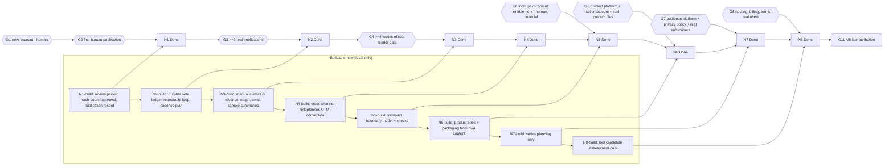

# N track plan (N1–N8): scope and buildability

This page is the detailed definition of the N track (the additional revenue track that starts
with the note channel). The order and status of each phase live in
[`docs/roadmap.md`](../roadmap.md).

**Order (decided by the human, 2026-09-30):**

C10 (closed) → N1 → N2 → N3 → N4 → N5 → N6 → N7 → N8 → C11

**Where the definitions come from.**

- N0–N3 were already defined in [note-channel.md](note-channel.md). They are restated here with
  the full fields.
- N4–N8 did not exist in the repository before 2026-09-30. Claude wrote their definitions from
  the N track's purpose (turning the note channel into additional revenue). **The human may
  rename, merge or reorder them.** If the scope changes, update this page and
  `docs/project-roadmap.json` together.

## Ground rules for the whole track

- **No fictional integrations.** Do not write an adapter, client, schema mapping or importer for
  a provider, API, file format or sales report that the project has never actually seen.
  - This applies to note, sales platforms, newsletter or membership providers, billing
    providers and hosting.
  - A provider is built against only after its real behaviour has been observed: a real account,
    a real export, real documentation.
- **No fabricated data.** Never create, seed or estimate sales, readers, subscribers or revenue
  in production.
  - Test fixtures are allowed only as clearly labelled fixtures for the project's own data
    model. They are never shaped like a guessed provider format.
  - Zero is a valid, recorded result. It is never reported as success.
- **Buildable Now** means provider-independent code that stays useful unchanged once real
  services exist:
  - local models and ledgers;
  - review and approval gates;
  - manual-entry records with provenance;
  - safety checks, packaging and plans.
- **Build-complete ≠ Done.** A phase can be build-complete while its Definition of Done still
  waits for real evidence (a publication, a sale, a user). The roadmap tracks the two
  separately, just as C10 tracks "implemented" and "production activation".
- **Human approval stays.** The human approves and performs:
  - every publication;
  - every price;
  - every account;
  - every use of money or personal data;
  - every new external call pattern.

  N0's rule "no automatic publication" holds for the whole track unless the human explicitly
  changes it.
- **Existing human stop conditions still apply**, for example:
  - production migration apply;
  - credentials and scopes;
  - a new external API call behaviour;
  - Task Scheduler structure;
  - tracking URL / SubID changes;
  - first emails.

## Dependency graph

How to read the graph:

- The **build chain** (B1…B8) runs in the current environment without external preparation.
  - B1–B4 are substantial.
  - B5 and B6 are narrow, provider-independent pieces.
  - B7 and B8 are planning only.
- Each **Done** needs its phase's build, the previous phase's Done, and a real-world gate (G).
- **The first real gate is G1/G2** (a human note account and one human publication). Every Done
  from N1 onward depends on it, so it is the most valuable external preparation to start early.
- C11 follows N8 in the development order. Its own dependency (a per-click reference from the
  ASPs, as assessed in C10-A) is independent of the N track.

| Gate | What is needed | Who |
|---|---|---|
| G1 | a note account the human owns and signs in to (the repository stores no credentials) | human |
| G2 | the first note piece published by the human in the note editor, and its URL | human |
| G3 | at least 3 real pieces published through the N2 loop | human (publishing), Claude (tooling) |
| G4 | about 4 weeks of reader numbers copied by hand from the note dashboard; a GA4 source dimension only if the human approves that new query pattern | human |
| G5 | paid content enabled on note (identity and payout setup), a price, the first paid piece | human only (financial) |
| G6 | a chosen sales platform, a seller account, real product source files (for example, workflow exports from the human's real accounts), the first listing | human |
| G7 | a chosen audience platform (for example, note membership or a newsletter), a privacy policy, consent handling, real subscribers | human |
| G8 | hosting, domain, billing provider, terms, privacy policy, real users | human |

---

## N1 — note pilot: the first human-reviewed piece

- **Purpose:** publish one note piece end to end under the N0 review contract, and learn the real
  publication flow on note.
- **Entry criteria:**
  - N0 is complete;
  - C10 is closed;
  - no N phase is in progress.
- **Scope:**
  - The human picks one candidate.
  - The draft is refined with the human.
  - A review packet: final title, reader-facing body, external links, images, and the warnings
    still open.
  - A hash-bound approval of the final title and body.
  - Export in a form that can be pasted into the note editor.
  - The human publishes.
  - The URL and its observation time are recorded back as publication evidence.
  - Reconfirm, read-only, how note supports posting today.
- **Out of scope:**
  - automatic or scripted publication;
  - unofficial note APIs;
  - login automation;
  - account creation;
  - images generated for note;
  - paid content;
  - measurement beyond recording the URL.
- **External dependencies:** G1 (a human-owned note account), G2 (the human publishes).
- **Buildable Now:**
  - Refresh the topic catalog so recent milestones (C9 and C10) can become candidates, with the
    evidence rules unchanged.
  - A review-packet export: Markdown and plain text, with the evidence section removed and every
    warning listed.
  - An approval record bound to `content_hash`, reusing the N0 state machine
    (`draft → review_ready → approved`).
  - A publication record whose URL host is checked against an allowlist in config. It is
    refused unless the published body hash equals the approved hash.
  - Project state shows the pending human step.
- **Requires real service or real data:**
  - the note account;
  - the published URL;
  - the human's reading of note's current posting options and terms.
- **Human stop conditions:**
  - creating or signing in to a note account;
  - the final title and body approval;
  - external links and images;
  - the act of publishing;
  - any automation of note's editor.
- **Definition of Done:**
  - one piece is published by the human;
  - its record is `published`, with the URL and observed time;
  - the approved hash equals the published body's hash;
  - the lessons are written to the decision log.
- **Outputs:**
  - the approval and publication records;
  - a decision-log entry;
  - an updated `note-channel.md` describing the real posting flow.
- **Next-phase dependencies:** N2 designs its loop from this real run. N2's build may start
  earlier, but N2 is not Done without N1 Done.

## N2 — repeatable production and review workflow

- **Purpose:** make "candidate → draft → review → approval → publication record" a routine that
  the human can repeat without ad-hoc steps.
- **Entry criteria:** N1 is build-complete. N2 cannot be Done until N1 is Done.
- **Scope:**
  - A durable note ledger for candidates, drafts, approvals and publications. Today everything
    is in git-ignored `reports/note/` files. The ledger is either a versioned file store or DB
    tables, decided in N2; if it is DB tables, a migration is rehearsed first.
  - Deduplication against pieces already published.
  - A cadence plan (about two a week is a guideline, not an invariant).
  - Links to the decision log.
  - Project-state counts.
- **Out of scope:**
  - automatic publication;
  - scheduled tasks for note (a new task is a Task Scheduler decision);
  - LLM drafting (a new model-call pattern is a human decision; N0 is deterministic).
- **External dependencies:** G3 (real pieces published by the human).
- **Buildable Now:**
  - the ledger and its migration, implemented and rehearsed;
  - the loop CLI;
  - duplicate checks that include published note bodies;
  - the cadence plan (plan only);
  - tests with labelled fixtures of the project's own model.
- **Requires real service or real data:** at least 3 real publications to prove the loop.
- **Human stop conditions:**
  - production migration apply;
  - each publication;
  - any new scheduled task;
  - any model-assisted drafting.
- **Definition of Done:**
  - 3 consecutive pieces go through the loop with complete records;
  - no step happens outside the tools except the human's publishing in note;
  - no piece is published without an approved hash.
- **Outputs:**
  - the durable ledger;
  - the loop CLI;
  - an operations runbook section in `note-channel.md`.
- **Next-phase dependencies:** N3 measures what the N2 ledger records.

## N3 — operationalization and measurement

- **Purpose:** know how pieces are read, without claiming causality from small samples, and
  review the cadence with evidence.
- **Entry criteria:** N2 is build-complete (Done requires N2 Done).
- **Scope:**
  - A **channel-agnostic manual metrics and revenue ledger**. Each entry records:
    - the subject;
    - the metric;
    - the value;
    - the observed period;
    - provenance `manual_entry`;
    - who entered it;
    - when.

    N5–N8 reuse this same ledger for sales and subscriber counts.
  - Reading numbers for note pieces are copied by hand from the note dashboard.
  - Summaries safe for small samples, reusing the T5 / C9-C conventions (no winners and losers,
    no causal wording).
  - A cadence review.
- **Out of scope:**
  - scraping note;
  - unofficial note endpoints;
  - estimating unobserved numbers;
  - new GA4 dimensions without approval.
- **External dependencies:**
  - G4 (real reader numbers over time);
  - optionally a GA4 source dimension. The current GA4 import only reads `date` and `pagePath`,
    so a note → WordPress referral view is a **new query pattern** and needs the human's
    decision.
- **Buildable Now:**
  - the manual ledger, its CLI, validation and provenance;
  - the small-sample summaries;
  - project-state and `system_status.py` visibility;
  - tests.
- **Requires real service or real data:**
  - real dashboard numbers for real pieces;
  - any referral data.
- **Human stop conditions:**
  - a new GA4 query pattern;
  - entering data on the human's behalf from sources Claude cannot see;
  - changing the cadence.
- **Definition of Done:**
  - numbers are recorded for at least 3 published pieces over at least 4 weeks;
  - the summary states its sample size and makes no causal claim;
  - the cadence decision is logged.
- **Outputs:**
  - the manual ledger (the shared foundation for N5–N8);
  - a measurement section in `note-channel.md`.
- **Next-phase dependencies:** N4 uses the ledger to see whether cross-channel links carry
  readers.

## N4 — cross-channel distribution (note ↔ WordPress ↔ Threads)

- **Purpose:** connect note to the existing channels:
  - note pieces point readers to relevant WordPress articles;
  - Threads can announce a note piece through the existing proposal approval.
- **Entry criteria:** N3 is build-complete (Done requires N3 Done and published note URLs).
- **Scope:**
  - a link planner that finds the WordPress articles related to a note piece (using the C10
    content clusters);
  - a deterministic link convention (for example UTM parameters) for links placed in note;
  - a Threads proposal *request* for announcing a note piece, handled by the existing generation
    request, proposal approval and publication path;
  - measurement through the N3 ledger.
- **Out of scope:**
  - changing affiliate tracking URLs or SubIDs;
  - direct Threads publication;
  - direct model calls;
  - automatic insertion of links into published note pieces.
- **External dependencies:**
  - real published note URLs (G2/G3);
  - a human decision to allow Threads posts that link to note;
  - a human decision on UTM use in public links.
- **Buildable Now:**
  - the link planner;
  - the convention builder;
  - the request type with its gates, off by default;
  - tests.
- **Requires real service or real data:** published note URLs; real traffic before any
  conclusion.
- **Human stop conditions:**
  - the first Threads post linking to note;
  - UTM on public links;
  - any change to the Threads publication policy.
- **Definition of Done:**
  - at least one approved Threads announcement of a real note piece;
  - at least one note piece links to WordPress through the convention;
  - the resulting numbers are recorded, with no causal claim.
- **Outputs:**
  - the planner and convention;
  - the request type;
  - the documentation.
- **Next-phase dependencies:** N5 relies on N4's distribution to reach readers for a paid piece.

## N5 — paid note pilot

- **Purpose:** learn whether a paid note piece sells, with the result (including zero) recorded
  honestly.
- **Entry criteria:**
  - N4 is Done;
  - the human decides to try paid content.
- **Scope:**
  - a free / paid boundary in the draft model: the free part must be useful on its own, and the
    paid part must deliver what the free part promises;
  - checks against misleading claims and against revenue claims without records;
  - a price recorded by the human;
  - sales copied by hand from note into the N3 ledger (source `manual_entry`).
- **Out of scope:**
  - any payment handling by the project;
  - automated sales import;
  - price experiments without the human;
  - fabricated or estimated sales.
- **External dependencies:** G5 (paid content enabled on note by the human: identity, payout and
  tax setup are human-only).
- **Buildable Now:**
  - the boundary model and its checks;
  - the review-packet extension for paid pieces;
  - a manual sales entry type in the N3 ledger;
  - tests.
- **Requires real service or real data:** the enabled seller account; real buyers; the note
  sales dashboard.
- **Human stop conditions:**
  - enabling sales (financial and identity);
  - pricing;
  - the first paid publication;
  - refunds.
- **Definition of Done:**
  - one paid piece is published by the human;
  - its sales are recorded by hand for an agreed period (zero is a valid result);
  - a decision to continue or stop is logged.
- **Outputs:**
  - the paid-piece workflow;
  - the manual sales records;
  - a decision-log entry.
- **Next-phase dependencies:** N6 decides from N5's real result whether selling products is worth
  it.

## N6 — own digital products

- **Purpose:** sell small digital products that come out of the project's own work (for
  example, checklists, guides, workflow templates).
- **Entry criteria:**
  - N5 is Done;
  - the human chooses a sales platform. The platform is not assumed; note, a marketplace or
    another service are all possible.
- **Scope:**
  - a product specification (what it is, for whom, what is included, licence);
  - packaging from repository-owned content (documents to a PDF or zip bundle);
  - quality checks (no secrets, no third-party copyrighted material, reader-facing wording);
  - sales recorded by hand in the N3 ledger.
- **Out of scope:**
  - integrating a sales platform before one is chosen and observed;
  - validating third-party template formats from guesses;
  - automated fulfilment;
  - payment handling.
- **External dependencies:**
  - G6 (a platform, a seller account, the first listing);
  - real product source files, for example workflow exports from the human's real accounts.
- **Buildable Now:**
  - the specification model;
  - packaging and checks for the project's own documents;
  - tests.
- **Requires real service or real data:**
  - the platform and its rules;
  - real exported templates;
  - real sales.
- **Human stop conditions:**
  - the platform account;
  - pricing;
  - licence and legal wording;
  - the first listing;
  - anything involving money or taxes.
- **Definition of Done:**
  - at least one product is listed by the human;
  - its sales are recorded for an agreed period (zero is valid);
  - the continue / stop decision is logged.
- **Outputs:**
  - the product spec and packaging pipeline;
  - the listing record;
  - the sales records.
- **Next-phase dependencies:** N7 builds an owned audience for the content and products that
  proved useful.

## N7 — owned audience (membership or newsletter)

- **Purpose:** keep a direct relationship with readers (for example note membership or an email
  newsletter), with consent and privacy handled properly.
- **Entry criteria:**
  - N6 is Done;
  - the human chooses an audience platform.
- **Scope:**
  - series planning for member or subscriber content, reusing the N2 loop;
  - subscriber counts entered by hand (numbers only, no personal data) in the N3 ledger;
  - the privacy-policy and consent requirements, written down for the human.
- **Out of scope:**
  - storing personal data of subscribers in the project;
  - sending email to subscribers from the project;
  - integrating a newsletter provider before one is chosen and observed.
- **External dependencies:** G7 (the platform, the privacy policy, consent handling, real
  subscribers).
- **Buildable Now:** series planning only (the N2 loop already exists by then). Nothing
  provider-specific.
- **Requires real service or real data:**
  - the platform;
  - real subscribers;
  - a published privacy policy.
- **Human stop conditions:**
  - collecting personal data;
  - publishing a privacy policy;
  - any email to subscribers;
  - pricing a membership.
- **Definition of Done:**
  - the platform is running under the human's account;
  - the first member or subscriber piece is published by the human;
  - counts are recorded for an agreed period;
  - the continue / stop decision is logged.
- **Outputs:**
  - the series plan;
  - the audience count records;
  - the documentation.
- **Next-phase dependencies:** N8 only considers a tool for an audience that exists.

## N8 — tool / SaaS pilot and N-track review

- **Purpose:**
  - decide, with real audience evidence, whether one small tool that comes out of the project
    is worth offering;
  - close the N track with a review of all N revenue before C11.
- **Entry criteria:** N7 is Done.
- **Scope:**
  - An assessment of tool candidates from capabilities the project already has, for example the
    project-state report or the content analysis. The assessment is based on the recorded
    audience and reader evidence.
  - If the human approves, a pilot with real users.
  - An N-track review over the N3 ledger (all N revenue and audience numbers, including zeros).
- **Out of scope:**
  - hosting, billing or user accounts before the human decides;
  - fabricated usage or revenue;
  - changing affiliate attribution (that is C11).
- **External dependencies:** G8 (hosting, domain, billing provider, terms, privacy policy, real
  users).
- **Buildable Now:** the candidate assessment (a document) and the N-track review queries over
  the N3 ledger.
- **Requires real service or real data:**
  - everything that makes a service run;
  - real users;
  - real payments.
- **Human stop conditions:**
  - any infrastructure or billing account;
  - credentials;
  - terms;
  - the first real user;
  - any money.
- **Definition of Done:**
  - either the pilot runs with real users and its results are recorded, or a logged decision not
    to build one;
  - the N-track review is written.
- **Outputs:**
  - the assessment;
  - the pilot record or the decision not to build;
  - the N-track review.
- **Next-phase dependencies:** C11 starts after N8 and brings affiliate revenue into the same
  review.

---

## Continuous work possible now vs waiting for external preparation

| Can be built now without external preparation | Waits for real services, data or people |
|---|---|
| **N1:** topic refresh, review packet, hash-bound approval, publication record | a note account (G1) and the first publication (G2) |
| **N2:** durable ledger (migration rehearsed; apply = human), loop CLI, dedupe, cadence plan | 3 real publications (G3) |
| **N3:** manual metrics / revenue ledger, small-sample summaries | real reader numbers (G4); a GA4 source dimension = human decision |
| **N4:** link planner, link convention, Threads announcement request (off) | real note URLs; the Threads / UTM decisions |
| **N5:** free / paid boundary model and checks, manual sales entry type | note paid-content enablement (G5, financial: human only) |
| **N6:** product spec, packaging of own documents, checks | platform, seller account, real product files, real sales (G6) |
| **N7:** series planning only | platform, privacy policy, real subscribers (G7) |
| **N8:** assessment document, N-track review queries | hosting, billing, terms, real users (G8) |
