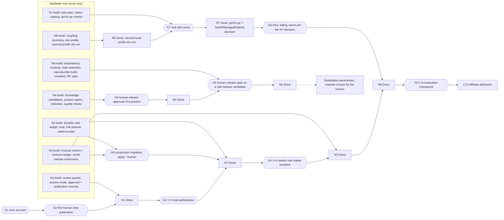

# N track plan (N1–N8): scope and buildability

This page is the detailed definition of the N track. The order and status of each phase live in
[`docs/roadmap.md`](../roadmap.md).

**Order (decided by the human, 2026-09-30):**

C10 (closed) → N1 → N2 → N3 → N4 → N5 → N6 → N7 → N8 → C11

**Where the definitions come from.**

- N0–N3 come from [note-channel.md](note-channel.md).
- N4–N8 are the **formal definitions given by the human on 2026-09-30**:
  - N4 Productized Knowledge
  - N5 Digital Product Automation
  - N6 System Productization
  - N7 SaaS Validation
  - N8 SaaS / Service

  They replace the provisional N4–N8 written earlier the same day. The useful parts of the
  provisional phases were moved rather than dropped (see *Relocated elements*).

## Ground rules for the whole track

- **No fictional integrations.** Do not write an adapter, client, schema mapping or importer for
  anything the project has never actually observed. This covers:
  - note, Gumroad, Stripe, Shopify or any sales, billing, newsletter, membership or ASP provider;
  - a provider's API;
  - a provider's file format;
  - a provider's tracking behaviour.

  A provider is built against only after a real account, a real export or real documentation
  has been observed.
- **No fabricated data.** Never create, seed or estimate these in production:
  - sales;
  - page views;
  - readers;
  - subscribers;
  - users;
  - revenue.

  Test fixtures are clearly labelled fixtures of the project's own data model. Zero is a valid,
  recorded result and is never reported as success.
- **Buildable Now** means provider-independent code that stays useful unchanged once real
  services exist:
  - local models, ledgers and gates;
  - manual-entry records with provenance;
  - safety checks, builds, manifests and plans.
- **Build-complete ≠ Done.** A phase can be build-complete while its Definition of Done waits for
  real evidence or a human decision, just as C10 tracks "implemented" separately from
  "production activation".
- **Entry criteria do not freeze independent work.** When an earlier phase's Done is waiting on
  an external gate, later Buildable Now work continues. Only the dependent parts stay PENDING.
- **Product lifecycle ≠ distribution.**
  - The *lifecycle* covers candidate → structure → build → validation → release candidate →
    human release approval. It belongs to N4 / N5 and is local.
  - *Distribution* covers where and how a released product is offered or sold. It is a separate
    workstream (see *Distribution workstream*). No distribution adapter exists before a real
    channel is chosen and observed.
- **Human stop conditions for the whole track:**
  - production migration apply;
  - any external publication (a note post, a product page, a listing);
  - the first sale;
  - enabling billing;
  - credential or scope changes;
  - any real external write;
  - connecting a new provider;
  - offering anything to real users;
  - real ASP tracking changes;
  - irreversible production changes;
  - important changes to approval semantics.

  The C10 human stops (first body apply, first meta write, first Growth digest email, mobile
  relay deploy) also stay in force.

## Relocated elements (from the provisional N4–N8)

| Element | New home |
|---|---|
| WordPress / Threads / note links | distribution scope of N1–N4 (N1 links in the review packet; N2 link planner + link convention; N3 cross-channel measurement; N4 announcing a released product through existing channels) |
| paid note | N1 (the pilot's access mode is recorded; free by default) and N4 (a paid note is one possible product format / distribution candidate) |
| own digital products | N4 (structure, evidence, redaction, release approval) and N5 (build, versioning, release candidates) |
| newsletter / membership | distribution candidates of the distribution workstream (after N4 / N5); nothing is built for them before a platform is chosen |
| tool pilot | N6 (productizing the system) and N7 (validating it with real users) |
| SaaS pilot | N7 |
| SaaS / Service in production | N8 |

## Dependency graph

How to read the graph:

- **N4, N5 and N6 do not depend on note having an audience.**
  - N4 and N5 need only the project's own evidence and a human approval.
  - N6 needs nothing external at all.
- So the current environment can carry the build chain through **N1 → N7-build**. The places
  where work actually stops are:
  - the production migration (M1);
  - the note account and publications (G1–G4);
  - human release approvals (H4, H5);
  - real pilot users (G7).
- N8 is decided by N7's evidence. Nothing in N8 is built before that.

**Gate status (2026-09-30):** M1 done (migration applied); G1 done (note `ai_growth_jp`); G2 done by a pre-system manual bootstrap publication (not N1-approved; see note-channel.md); G3 1 / 3; G4 not met; H4 / H5 / G7 / G8 pending.

| Gate | What is needed | Who |
|---|---|---|
| M1 | apply the N2/N3 ledger migration to production (after its rehearsal) | human |
| G1 | a note account the human owns and signs in to (no credentials in the repository) | human |
| G2 | the first note piece, published by the human, and its URL | human |
| G3 | at least 3 real pieces through the N2 loop | human (publishing) |
| G4 | about 4 weeks of reader numbers copied by hand from the note dashboard; a GA4 source dimension only if the human approves that new query pattern | human |
| H4 | the human approves one structured product for release (the approval is local; it is not a sale) | human |
| H5 | the human approves a real release candidate (the manifest hash) | human |
| G7 | real pilot users recruited and onboarded by the human | human |
| G8 | whatever the N7 decision requires (hosting, authentication, billing, terms, support) | human |

---

## N1 — note pilot: the first human-reviewed piece

- **Purpose:** publish one note piece end to end under the N0 review contract, and learn the real
  publication flow on note.
- **Entry criteria:** N0 is complete and C10 is closed.
- **Scope:**
  - The human picks one candidate. Recent milestones (C10) are added as candidate topics.
  - The draft is refined with the human.
  - A **review packet**: final title, reader-facing body, external links (distribution: links to
    related WordPress articles), images, open warnings.
  - The **access mode** (free, or paid if the human decides; free by default).
  - A **hash-bound approval** of the final title and body.
  - An export in a form that can be pasted into the note editor.
  - The human publishes.
  - The URL and its observation time are recorded as **publication evidence**, only when the
    published hash equals the approved hash.
- **Out of scope:**
  - automatic or scripted publication;
  - unofficial note APIs;
  - login automation;
  - account creation;
  - setting a price or starting sales (paid content is only recorded as a mode);
  - reader measurement.
- **External dependencies:**
  - G1 (the note account);
  - G2 (the human publishes);
  - for a paid pilot, note's paid-content setup by the human.
- **Buildable Now:**
  - the C10 topics;
  - the review-packet export (Markdown and plain text, with the evidence section removed);
  - the access-mode field;
  - the approval CLI bound to `content_hash`;
  - the publication-record CLI (URL host allowlist in config, approved hash required);
  - tests.
- **Requires real service or real data:**
  - the note account;
  - the published URL;
  - note's current posting options and terms (read by the human).
- **Human stop conditions:**
  - account creation or sign-in;
  - the final title and body approval;
  - external links and images;
  - the act of publishing;
  - a paid mode (sales start);
  - automating note's editor.
- **Definition of Done:**
  - one piece is published by the human;
  - its record is `published`, with the URL and observed time;
  - the approved hash equals the published hash;
  - the lessons are in the decision log.
- **Outputs:**
  - approval and publication records;
  - a decision-log entry;
  - `note-channel.md` updated with the real posting flow.
- **Next-phase dependencies:** N2 records N1's pieces in the durable ledger. N2's build does not
  wait for N1 Done.

## N2 — repeatable production and review workflow

- **Purpose:** make "candidate → draft → review → approval → publication record" a routine that
  the human can repeat without ad-hoc steps.
- **Entry criteria:** N1 is build-complete (N2 Done needs N1 Done).
- **Scope:**
  - A durable **note ledger** (DB tables; the migration is rehearsed; the production apply is a
    human step), synced from the local drafts.
  - Deduplication against published note bodies.
  - A **cadence plan** (about two a week is a guideline, not an invariant).
  - A **link planner** (distribution): the WordPress articles related to a piece, through the C10
    content clusters and keywords.
  - A **link convention** (UTM or none); using it in public links is a human decision.
  - Project-state counts.
- **Out of scope:**
  - automatic publication;
  - new scheduled tasks;
  - model-assisted drafting (a new call pattern);
  - inserting links into published pieces.
- **External dependencies:** G3 (real publications); M1 (the migration apply).
- **Buildable Now:**
  - the ledger models, migration and service;
  - the sync and loop CLI;
  - the dedupe;
  - the cadence plan;
  - the link planner and convention;
  - tests;
  - a production-copy rehearsal.
- **Requires real service or real data:** at least 3 real publications.
- **Human stop conditions:**
  - the production migration apply;
  - each publication;
  - UTM in public links;
  - any new scheduled task.
- **Definition of Done:**
  - 3 consecutive pieces go through the loop with complete ledger records;
  - no piece is published without an approved hash.
- **Outputs:** the ledger, the loop CLI, the link planner, a runbook section.
- **Next-phase dependencies:** N3 measures what the ledger records.

## N3 — operationalization and measurement

- **Purpose:** know how pieces and channels perform without claiming causality from small
  samples, and review the cadence with evidence.
- **Entry criteria:** N2 is build-complete (N3 Done needs N2 Done).
- **Scope:**
  - A **channel-agnostic manual metrics and revenue ledger**. Each entry records:
    - the subject;
    - the metric (from a fixed catalog);
    - the value and unit;
    - the period;
    - provenance `manual_entry`;
    - the source description;
    - who entered it, and when.

    N4–N7 reuse it for product, sales and pilot numbers.
  - Summaries safe for small samples: the sample size is always shown, with no winners, no
    causal wording and no estimates.
  - Cross-channel measurement (distribution): note pieces and the WordPress articles they link to.
  - A cadence review.
- **Out of scope:**
  - scraping note;
  - unofficial endpoints;
  - estimating unobserved numbers;
  - new GA4 dimensions without approval (the GA4 import reads only `date` and `pagePath`).
- **External dependencies:** G4 (real numbers); M1 (the migration apply).
- **Buildable Now:**
  - the ledger (in the same migration as N2);
  - the metric catalog;
  - the record and list CLI with validation;
  - the summaries;
  - tests.
- **Requires real service or real data:** real dashboard numbers; any referral data.
- **Human stop conditions:**
  - the migration apply;
  - a new GA4 query pattern;
  - cadence changes.
- **Definition of Done:**
  - numbers are recorded for at least 3 published pieces over at least 4 weeks;
  - the summary states its sample size and makes no causal claim;
  - the cadence decision is logged.
- **Outputs:** the manual ledger (the shared foundation for N4–N7), a measurement section.
- **Next-phase dependencies:** N4 / N5 record product numbers here, and N7 records pilot numbers.

## N4 — Productized Knowledge

- **Purpose:** turn the knowledge that Affiliate AI's implementation, operations and evidence
  have produced into products that can be sold. Development logs are not packaged as they are.
  Each product is an **evidence-backed generalization**.
- **Entry criteria:**
  - the evidence base exists (docs, decision log, completed phases). It does today.
  - N4 does not wait for N1–N3 Done.
- **Scope:**
  - **Knowledge / product candidates:** deterministic discovery from completed phases, decisions
    and operations docs.
  - Each candidate states its **target user / problem / intended outcome**.
  - **Evidence / source traceability:** every product claim and every asset names the source
    (doc, decision, phase) it generalizes. The trace is checked when the product is built.
  - A **reusable vs site-specific distinction**: each asset declares what generalizes and what is
    excluded because it is specific to this site. Site-specific terms are flagged.
  - **Assets:** template, checklist, guide, config example (the project's own formats).
  - **Secret / privacy / internal-data redaction checks:**
    - tokens and credentials;
    - URLs with credentials;
    - local paths;
    - emails;
    - host names;
    - long digests;
    - internal identifiers;
    - this site's domain and account names.
  - **Product structure:** a product spec plus asset files under `products/<id>/`.
  - **Version:** semver.
  - **Quality review:** a local check list plus a human review record.
  - **Human release approval:** hash-bound. It approves release *readiness* only. It is not a
    sale or a publication.
- **Out of scope:**
  - distribution, listing, pricing or sales;
  - any provider integration;
  - packaging raw logs;
  - claims of revenue or results that are not in the evidence.
- **External dependencies:** none for the lifecycle. Selling needs the distribution workstream.
- **Buildable Now:**
  - the knowledge-candidate catalog and discovery;
  - the product spec model and validation;
  - the traceability check;
  - the redaction check;
  - the quality checks;
  - the review and approval records;
  - the first product draft, written from evidence;
  - tests.
- **Requires real service or real data:** none to reach an approved release candidate. Real
  buyers are needed only for distribution.
- **Human stop conditions:**
  - the release approval itself;
  - any external publication or listing;
  - pricing;
  - the first sale.
- **Definition of Done:**
  - at least one product has its evidence trace verified, redaction clean and quality checks
    passing;
  - the product is human-approved for release.
- **Outputs:**
  - the product specs and assets;
  - the candidate catalog;
  - the review and approval records.
- **Next-phase dependencies:** N5 builds and versions the N4 products.

## N5 — Digital Product Automation

- **Purpose:** keep N4 products continuously buildable, updatable and versioned. Sources change,
  so products must notice that and be rebuilt deliberately.
- **Entry criteria:** N4 product specs exist. Done needs one real N4 product.
- **Scope:**
  - **Source dependency tracking:** a hash of every source an asset is generalized from.
  - **Stale detection:** a source changed since the last release manifest.
  - A **rebuild / update plan**.
  - **Versioning:** semver, monotonic, bump chosen by the human.
  - A **changelog:** an entry is required for each version.
  - A **deterministic, reproducible build:** sorted entries, fixed timestamps, normalized line
    endings. The same inputs give the same bytes.
  - A **release manifest:** file and source hashes, the version, the build input hash.
  - **Package validation:** declared assets present, no undeclared files, size limits.
  - **Redaction / security validation** of the built files.
  - A **release candidate** status.
  - A **human release gate** bound to the manifest hash.
- **Out of scope:**
  - distribution;
  - any provider adapter (note, Gumroad, Stripe, Shopify, …);
  - uploads;
  - automatic releases;
  - pricing.
- **External dependencies:** none. Distribution is separate.
- **Buildable Now:** all of the scope, with tests.
- **Requires real service or real data:** none for the lifecycle.
- **Human stop conditions:**
  - the release gate;
  - anything leaving the machine (an upload, a publication, a sale).
- **Definition of Done:**
  - one real N4 product builds reproducibly (twice, same manifest);
  - staleness is detected when a source changes;
  - a release candidate passes validation and the human release gate.
- **Outputs:**
  - the build / validate / plan / release-gate CLI;
  - the manifests and changelogs;
  - the release candidates (in git-ignored `reports/products/`).
- **Next-phase dependencies:** the distribution workstream takes approved releases. N6 is
  independent.

## N6 — System Productization

- **Purpose:** separate Affiliate AI into a reusable core and site-specific parts. It is still
  one installation; this is not multi-tenant SaaS.
- **Entry criteria:** none external. The coupling inventory comes first.
- **Scope:**
  - A **single-site coupling inventory** from source inspection. It covers:
    - site;
    - account;
    - path;
    - provider;
    - config;
    - secret;
    - DB;
    - scheduler;
    - content policy;
    - notification;
    - approval settings;
    - external integration.
  - The **reusable core boundary**.
  - **Site configuration:** a site profile.
  - **Provider interfaces / adapters:** existing providers only.
  - The **secret boundary:** secrets stay in each site's own env, never in profiles.
  - A **data isolation strategy:** one database per site.
  - **Feature flags / capabilities** per site.
  - **Install / bootstrap** of a site profile.
  - A **migration strategy:** per-site Alembic upgrade.
  - **Contract tests.**
  - **Existing production compatibility:** without a profile, behaviour is unchanged.
- **Out of scope:**
  - multi-tenant SaaS (authentication, tenants, billing);
  - hosting;
  - a second real site;
  - changing the production site's configuration.
- **External dependencies:** none.
- **Buildable Now:** all of the scope, with tests.
- **Requires real service or real data:** none for the Definition of Done. A second *real* site
  would be a human decision.
- **Human stop conditions:**
  - pointing a profile at real external services;
  - any production configuration change;
  - new provider connections.
- **Definition of Done (strong):** a **second local site profile can be bootstrapped and
  dry-run without code changes**, with production untouched.
  - "Bootstrapped" means its own local database, migrated to head.
  - "Dry-run" means the read-only plans and health checks run against it, with every external
    provider disabled.
  - "Production untouched" means the production database hash, configuration and scheduled
    tasks are unchanged, and the contract tests pass.
- **Outputs:**
  - the coupling inventory;
  - the site profile schema and loader;
  - the bootstrap / dry-run CLI;
  - the contract tests.
- **Next-phase dependencies:** N7 validates the productized system with real users.

## N7 — SaaS Validation

- **Purpose:** find out, with **real users**, whether the productized system is worth something to
  others, and choose between SaaS, Managed Service and Hybrid.
- **Entry criteria:** N6 Done. Real pilot users are recruited by the human.
- **Scope:**
  - pilot onboarding;
  - activation;
  - time-to-first-value;
  - workflow completion;
  - repeat usage / retention evidence;
  - onboarding difficulty;
  - support burden;
  - operating and API cost;
  - willingness-to-pay / pricing evidence;
  - structured user feedback;
  - go/no-go criteria;
  - the **SaaS vs Managed Service vs Hybrid** decision.
- **Out of scope:**
  - any fabricated or simulated usage data;
  - billing;
  - public launch;
  - building N8 before the decision.
- **External dependencies:** G7 (real pilot users, the human's recruitment and agreements).
- **Buildable Now (planning and measurement infrastructure only):**
  - the pilot plan;
  - the pilot metric catalog in the N3 ledger (pseudonymous pilot references, no personal data);
  - the feedback structure;
  - the go/no-go criteria;
  - the decision template;
  - tests.
- **Requires real service or real data:** real pilot users and their real usage, feedback and
  cost.
- **Human stop conditions:**
  - offering anything to real users;
  - collecting personal data;
  - pricing conversations;
  - the go/no-go decision.
- **Definition of Done:**
  - the pilots ran with real users;
  - the metrics were recorded, with sample size stated;
  - go/no-go and SaaS / Managed / Hybrid are decided by the human with the evidence logged.
- **Outputs:**
  - the pilot records;
  - the decision record;
  - the requirements for N8.
- **Next-phase dependencies:** N8 builds only the chosen model.

## N8 — SaaS / Service

- **Purpose:** make the model chosen in N7 externally available.
- **Entry criteria:** N7 Done with a recorded decision.
- **Scope (only the chosen model is built):**
  - **SaaS:**
    - authentication;
    - users and roles;
    - tenant isolation;
    - secure credential handling;
    - onboarding;
    - job orchestration;
    - usage and entitlement;
    - billing integration;
    - observability;
    - audit;
    - backup and recovery;
    - export and delete;
    - admin and support tools;
    - terms and privacy readiness.
  - **Managed Service:**
    - a customer workspace;
    - intake;
    - site configuration;
    - the operations workflow;
    - the approval workflow;
    - reporting;
    - billing;
    - support;
    - the service policy.
  - **Hybrid:** an explicit responsibility boundary between the self-service part and the
    managed part, then the relevant items above.
- **Out of scope:**
  - building all three models;
  - anything before the N7 decision;
  - unobserved billing provider integrations.
- **External dependencies:** G8 (hosting, domain, billing provider, terms, privacy policy,
  support, real customers), as the chosen model requires.
- **Buildable Now:** nothing. The model is not chosen yet.
- **Requires real service or real data:** everything that makes the service run.
- **Human stop conditions:**
  - infrastructure and billing accounts;
  - credentials;
  - terms;
  - the first real customer;
  - enabling billing;
  - any money.
- **Definition of Done:** the chosen model serves real customers under the agreed terms, with
  backup / recovery and audit verified.
- **Outputs:** the service, runbooks, the N-track review.
- **Next-phase dependencies:** the T6.5 re-evaluation checkpoint, then C11.

## Distribution workstream (separate from the product lifecycle)

- The candidate channels are:
  - note (including paid note);
  - the WordPress site;
  - Threads announcements through the existing proposal approval;
  - a marketplace;
  - a newsletter or membership.

  **None is assumed.**
- The human chooses a channel. Its real behaviour is then observed (account, rules, formats).
  Only after that is anything built for it.
- Sales and subscriber numbers go into the N3 ledger by hand until a real export is observed.
- Human stops:
  - the channel account;
  - listing;
  - pricing;
  - the first sale;
  - personal data;
  - email to subscribers.

## Buildable now vs waiting

| Can be built now without external preparation | Waits for |
|---|---|
| **N1:** C10 topics, review packet, access mode, approval + publication CLIs | G1 note account, G2 first publication |
| **N2:** ledger + migration (rehearsed), sync / loop CLI, dedupe, cadence plan, link planner | M1 migration apply, G3 publications |
| **N3:** manual metrics / revenue ledger, catalog, summaries | M1, G4 real numbers |
| **N4:** candidates, product specs, traceability, redaction, quality checks, first product draft | H4 human release approval |
| **N5:** dependency tracking, stale detection, reproducible build, manifest, validation, RC, release gate | H5 human release gate on a real product |
| **N6:** coupling inventory, site profile, bootstrap + dry-run of a second local profile | nothing (Done is local) |
| **N7:** pilot plan, metric catalog, go/no-go and decision templates | G7 real pilot users |
| **N8:** nothing | the N7 decision, G8 |
